# Getting started with deaviz

`deaviz` turns the numbers behind a Data Envelopment Analysis (DEA),
whether the inputs/outputs profiles or the computational outcome of
various DEA models, into plots: efficiency distributions, input/output
relationships, an efficient frontier representation, projection biplots,
benchmarking networks, cross-efficiency maps, and multi-period
trajectories for panel data. This vignette walks through the typical
workflow on two bundled datasets.

The workflow has three steps that map onto the package’s naming
convention:

1.  wrap your data in a
    **[`dea_data()`](https://pomelo64.github.io/deaviz/reference/dea_data.md)**
    object (inputs, outputs, DMU labels);
2.  **`compute_*()`** the quantities you need (efficiency,
    cross-efficiency, weights, self-organising maps);
3.  **`plot_*()`** the result.

``` r

library(deaviz)
```

Most plots compute efficiency scores internally, which relies on the
**`Benchmarking`** package; a few embeddings/layouts use `smacof`,
`igraph`/`graphlayouts`, or `kohonen`. These are all *Suggests*: install
them to reproduce every figure below. (Where a suggested package is
missing, the corresponding chunk is simply skipped, so this vignette
always builds.)

## The data object

`deaviz` ships `chinese_cities`, a classic cross-sectional DEA benchmark
of 35 cities with three inputs and three outputs (Sueyoshi, 1992).
[`dea_data()`](https://pomelo64.github.io/deaviz/reference/dea_data.md)
records which columns are inputs, which are outputs, and which
identifies the DMU. Columns can be given by name or by position.

So the `dea_data` object can be defined either by the input and output
variable names as follows:

``` r

d <- dea_data(
  chinese_cities,
  inputs  = c("industrial_labour_force", "working_funds", "investments"),
  outputs = c("gross_industrial_output", "profit_and_tax", "retail_sales"),
  id      = "DMU"
)
d
#> <dea_data>
#>   DMUs    : 35
#>   Inputs  : 3 (industrial_labour_force, working_funds, investments)
#>   Outputs : 3 (gross_industrial_output, profit_and_tax, retail_sales)
```

or equivalently by the location of them:

``` r

d <- dea_data(
  chinese_cities,
  inputs  = 2:4,
  outputs = 5:7,
  id      = "DMU"
)
```

Everything downstream takes this `d` object. If your input/output
columns are prefixed `i_` / `o_`,
[`dea_data()`](https://pomelo64.github.io/deaviz/reference/dea_data.md)
detects them automatically and you can skip the `inputs`/`outputs`
arguments.

## Efficiency scores

[`compute_efficiency()`](https://pomelo64.github.io/deaviz/reference/compute_efficiency.md)
returns radial efficiency scores (plus peer weights and multiplier
weights). Returns-to-scale and orientation are arguments.

``` r

eff <- compute_efficiency(x = d, rts = "vrs", orientation = "in")
head(round(eff$eff, 3))
#> [1] 1.000 0.944 0.805 0.779 0.875 0.686
```

## Distributions: the shape of efficiency

Start by looking at the spread.
[`plot_efficiency_distributions()`](https://pomelo64.github.io/deaviz/reference/plot_efficiency_distributions.md)
shows the distribution of efficiency scores, while
[`plot_io_distributions()`](https://pomelo64.github.io/deaviz/reference/plot_io_distributions.md)
shows the raw input/output variables.

``` r

plot_efficiency_distributions(d, rts = "vrs", title = "Chinese Cities Efficiency Scores", subtitle = "Variable Return To Scale")
```

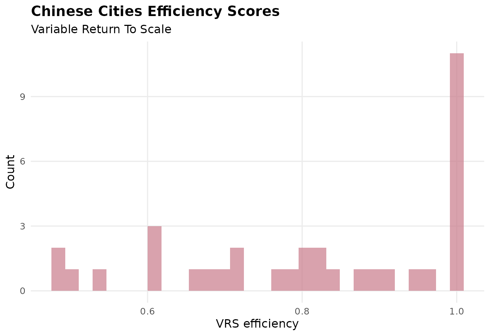

``` r

plot_io_distributions(d, type = "box", x_angle = 30)
```

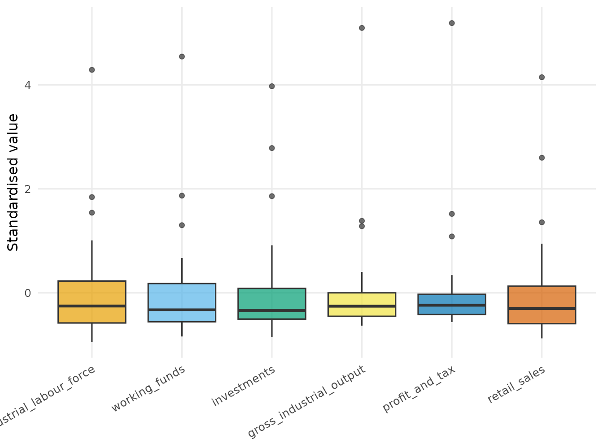

Note the `x_angle = 30`: the input/output names are long, so tilting the
x-axis tick labels keeps them readable. Every plot whose x-axis carries
variable or DMU names accepts `x_angle`.

[`plot_io_efficients()`](https://pomelo64.github.io/deaviz/reference/plot_io_efficients.md)
counts how many DMUs are efficient versus inefficient.

``` r

plot_io_efficients(d, rts = "vrs", transparency = 1)
```

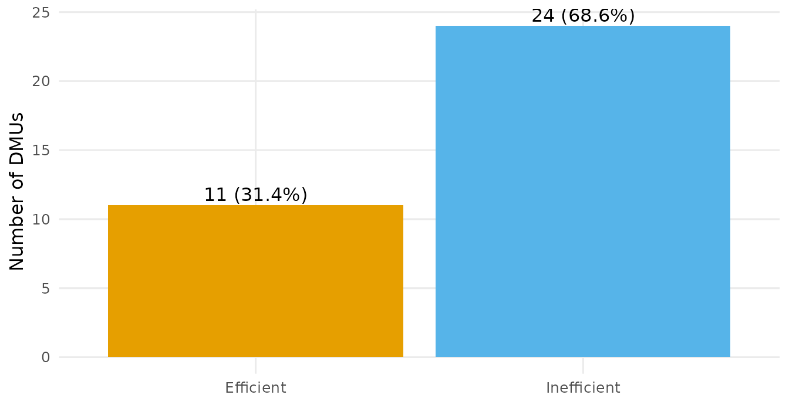

## Input/output relationships and the frontier

[`plot_io_scatter()`](https://pomelo64.github.io/deaviz/reference/plot_io_scatter.md)
lays out every input-against-output pair if no vector of inputs and/or
outputs is assigned to `vars =` and if a vector provided, then the
scatterplots will be limited to the pair-wise combination of the the
variables. Regardless, the visual marks are coloured by efficiency.

``` r


plot_io_scatter(d, vars = c("industrial_labour_force", "gross_industrial_output", "retail_sales") , color = "vrs")
```

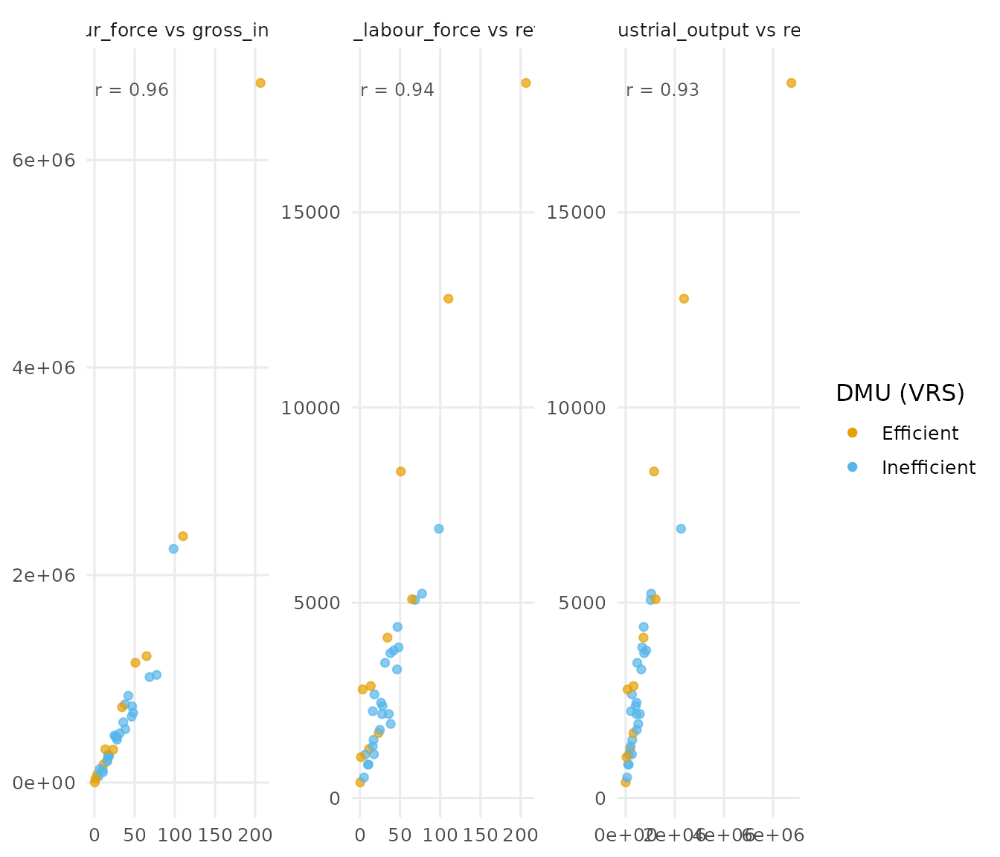

It is possible to plot scatters against the efficiency scores of the
DMUs as well:

``` r


plot_io_scatter(d, vars = c("industrial_labour_force", "gross_industrial_output", "retail_sales"), efficiency = "vrs" , color = "vrs")
```

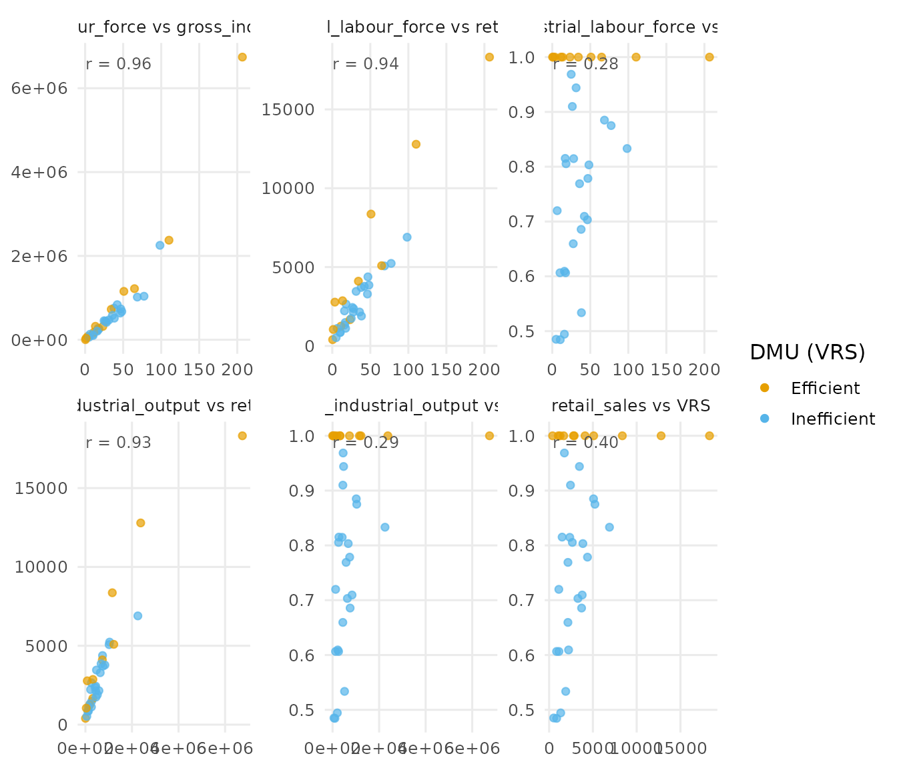

The only frontier visualization plot is available via
[`plot_io_costa_frontier()`](https://pomelo64.github.io/deaviz/reference/plot_io_costa_frontier.md)
and it collapses all inputs and outputs onto a single aggregated
frontier (Bana e Costa et al., 2016).

``` r

plot_io_costa_frontier(d)
```

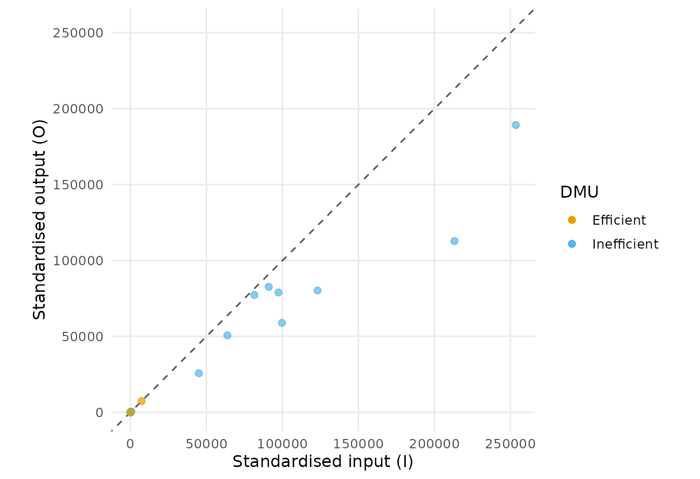

## The textbook frontier

For teaching it is often clearest to take a single input against a
single output and draw the efficient frontier the way textbooks do.
[`plot_io_frontier()`](https://pomelo64.github.io/deaviz/reference/plot_io_frontier.md)
does exactly that: pick one input and one output, choose the
returns-to-scale, and it shades the production-possibility set and
traces the frontier, colouring each unit by its efficiency in that
two-variable sub-model.

``` r

plot_io_frontier(d, input = "working_funds", output = "retail_sales",
                 rts = "vrs")
```

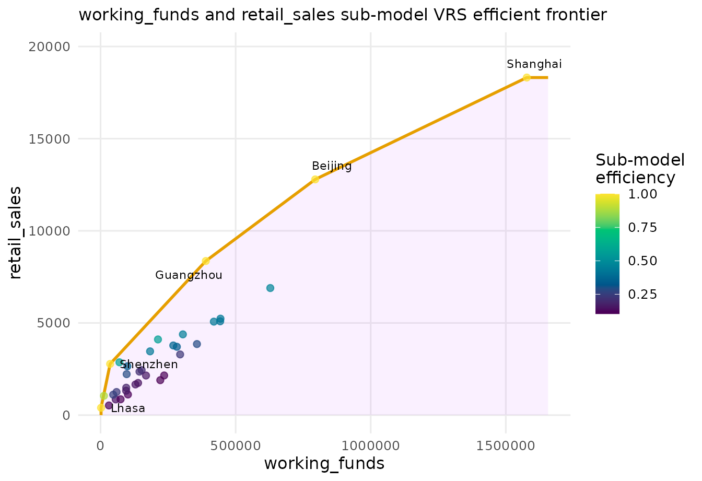

Turn on `peers_network` to see which efficient peers an inefficient city
is benchmarked against; the arrows are weighted by the envelopment
($`\lambda`$) weights.

``` r

plot_io_frontier(d, input = "working_funds", output = "retail_sales",
                 rts = "vrs", peers_network = TRUE, labels = "Chengdu")
```

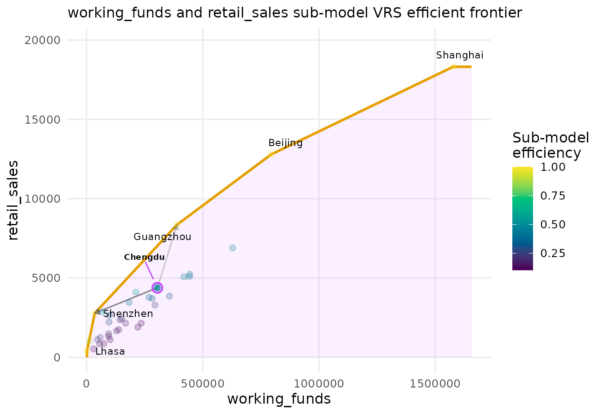

## Projection biplots

Two ways to project the multidimensional input/output space onto a
readable plane.
[`plot_io_pca_biplot()`](https://pomelo64.github.io/deaviz/reference/plot_io_pca_biplot.md)
uses PCA, drawing the input/output loading vectors;
[`plot_io_mds()`](https://pomelo64.github.io/deaviz/reference/plot_io_mds.md)
uses metric (ratio) multidimensional scaling via the **smacof**
majorization algorithm (de Leeuw & Mair, 2009). The graphical use of
such projections for DEA follows Adler & Raveh (2008).

Let’s have a look at the PCA biplot:

``` r

plot_io_pca_biplot(d, rts = "vrs")
```

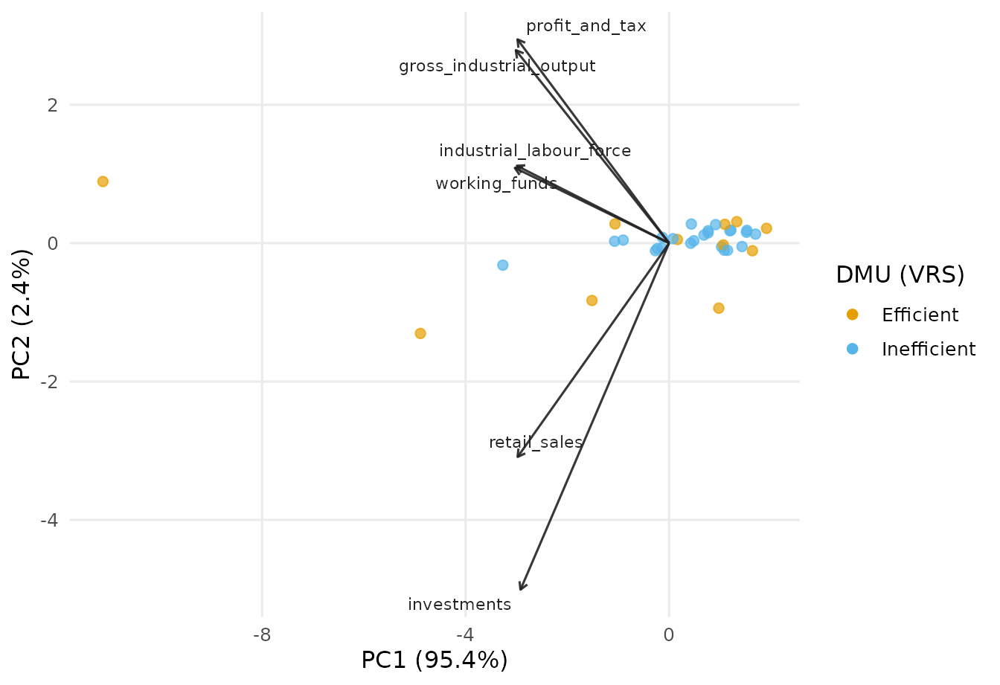

The vectors are the dataset’s inputs and outputs and they show the
direction towards which the value of the corresponding input or output
increases in the 2d space.

In contrast, we can use an MDS algorithm to reduce the dimensionality of
the dataset and represent the DMUs visually in a 2d plot.

``` r

plot_io_mds(d)
```

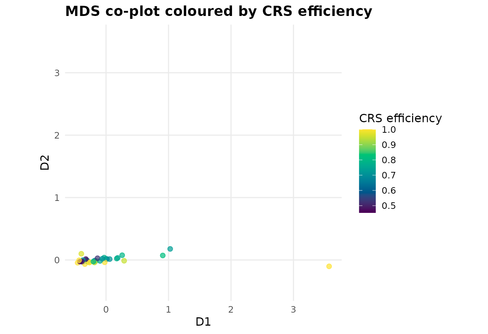

What to do with overcrowded plots? One solution offered by the `deaviz`
package is to make the plot interactive so one can zoom into the plot
and hover over the visual marks to get information about them.

``` r

plot_io_mds(d, interactive = TRUE)
```

## Benchmarking networks

For inefficient DMUs, DEA identifies the efficient peers they are
benchmarked against.
[`plot_io_lambda_network()`](https://pomelo64.github.io/deaviz/reference/plot_io_lambda_network.md)
draws those peer relationships weighted by the envelopment ($`\lambda`$)
weights, laid out with Sammon mapping (Sammon, 1969) as in Porembski et
al. (2005);
[`plot_io_peer_network()`](https://pomelo64.github.io/deaviz/reference/plot_io_peer_network.md)
lays out who is a peer to whom, therefore the edges are directed from
the inefficient units to their targets.

``` r

plot_io_lambda_network(d, rts = "vrs")
```

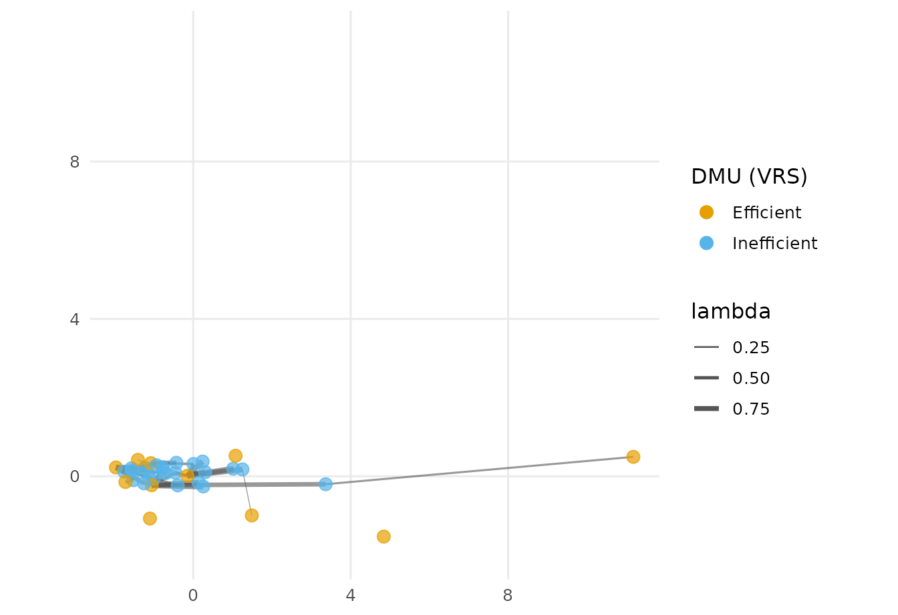

``` r

plot_io_peer_network(d, rts = "vrs")
```

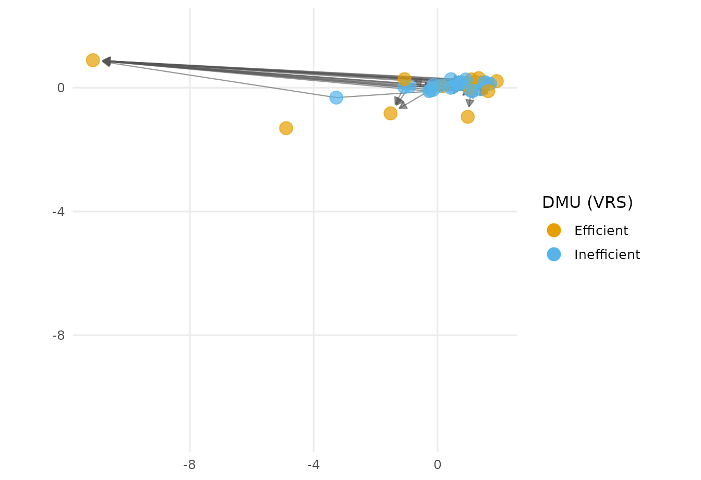

It is sometimes important in the networks to focus on and highlight a
specific DMU and `deaviz` package addresses that need via the `labels =`
argument:

``` r

plot_io_peer_network(d,layout = "fr",labels = "Xian", rts = "vrs")
```

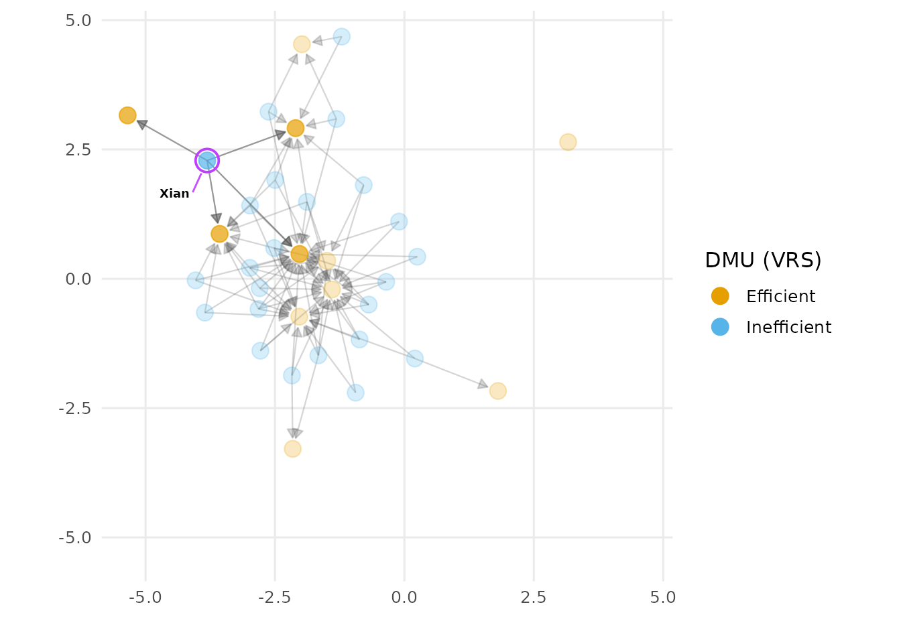

Pay attention that the default layout of the network is changed by
providing a pre-defined value to the `layout =` argument.

## Cross-efficiency

Cross-efficiency scores every DMU using every other DMU’s optimal
weights (Doyle & Green, 1994).
[`compute_cross_efficiency()`](https://pomelo64.github.io/deaviz/reference/cross-efficiency.md)
builds the matrix, which
[`plot_cem_heatmap()`](https://pomelo64.github.io/deaviz/reference/plot_cem_heatmap.md)
displays.
[`plot_cem_unfolding()`](https://pomelo64.github.io/deaviz/reference/plot_cem_unfolding.md)
unfolds the same matrix into a map of who rates whom favourably
(Ashkiani & Mar-Molinero, 2017), and
[`plot_cem_weights_heatmap()`](https://pomelo64.github.io/deaviz/reference/plot_cem_weights_heatmap.md)
shows the underlying weight profiles.

``` r

cem <- compute_cross_efficiency(d)

plot_cem_heatmap(cem, x_angle = 90)
```

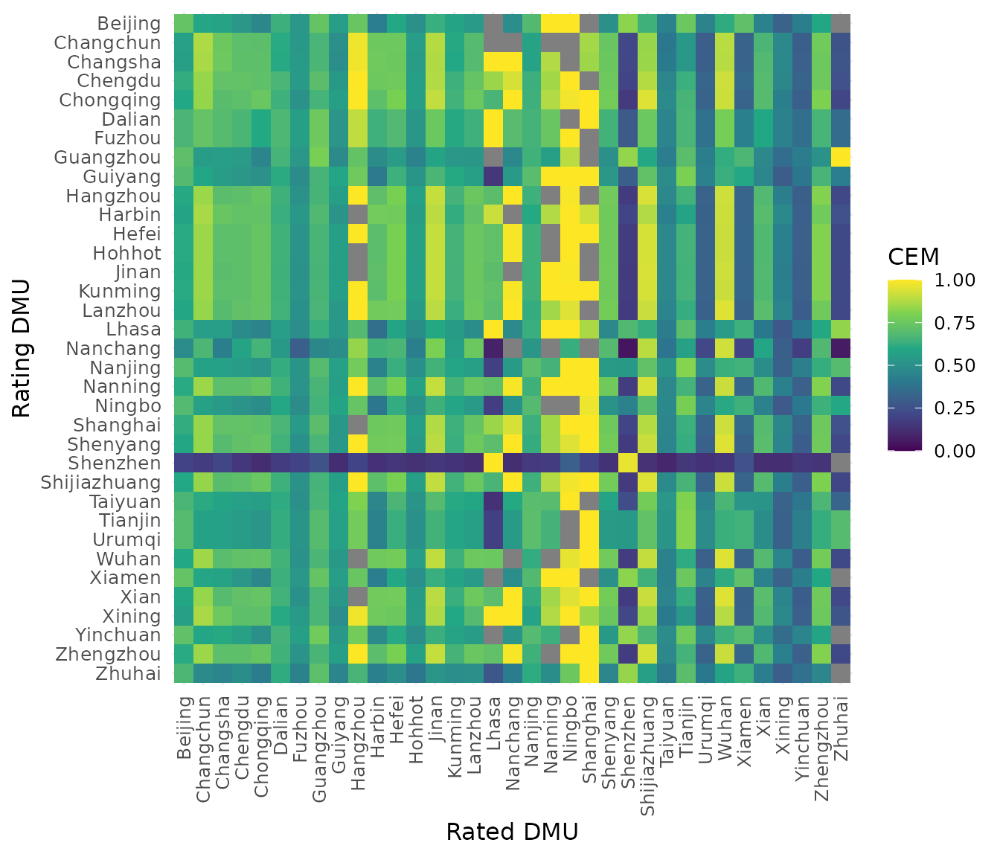

``` r

plot_cem_unfolding(cem)
```

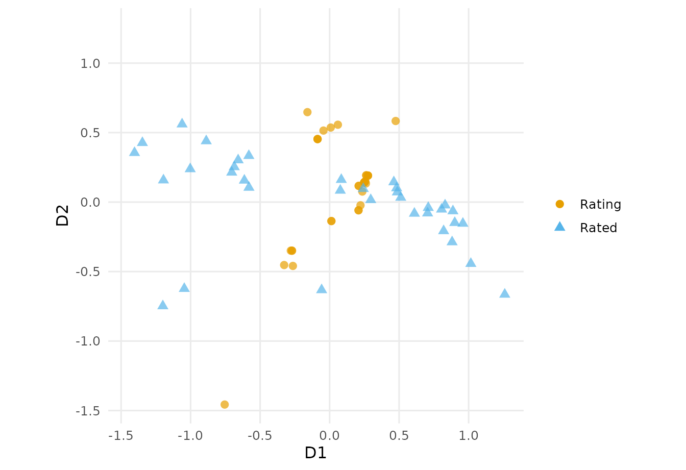

``` r

plot_cem_weights_heatmap(d, x_angle = 30)
```

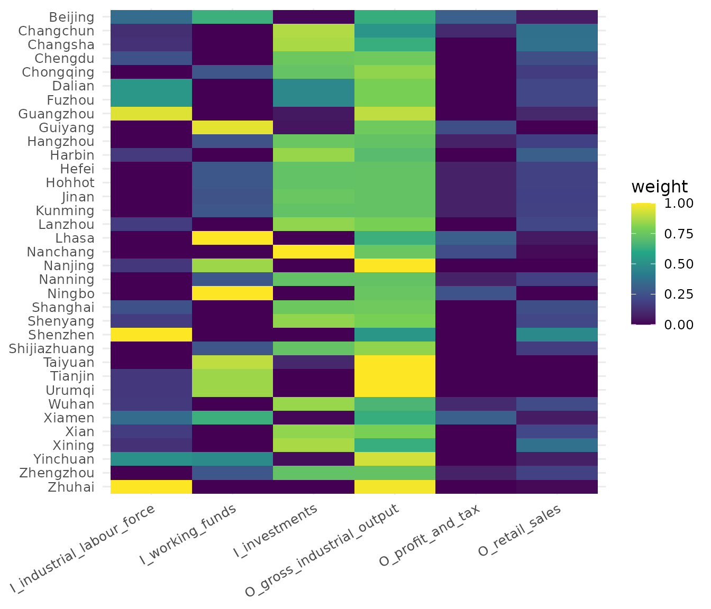

What if we want to highlight a specific DMU? Same as before, we can use
the `labels=` argument:

``` r

plot_cem_weights_heatmap(d, x_angle = 30, labels = "Xian")
```

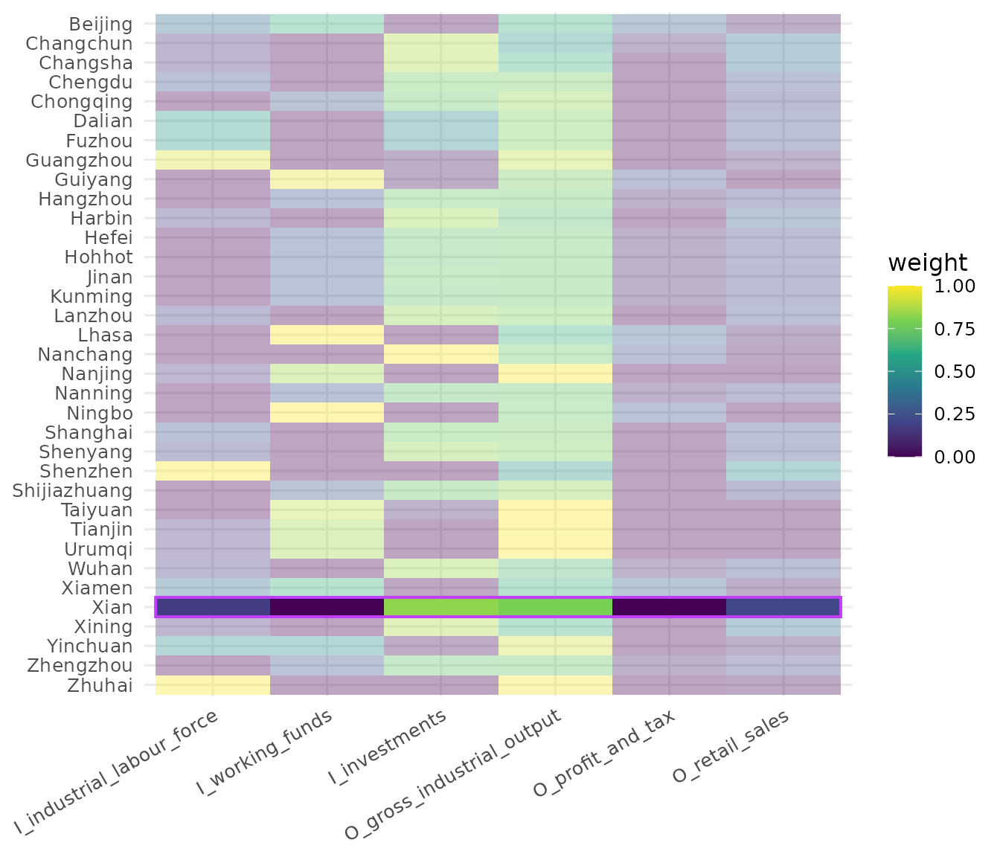

## Profile plots

[`plot_io_radar()`](https://pomelo64.github.io/deaviz/reference/plot_io_radar.md)
and
[`plot_io_parcoo()`](https://pomelo64.github.io/deaviz/reference/plot_io_parcoo.md)
show each DMU’s full input/output profile, as a radar polygon or a
parallel-coordinates line.

``` r

plot_io_radar(d, efficiency = "vrs")
```

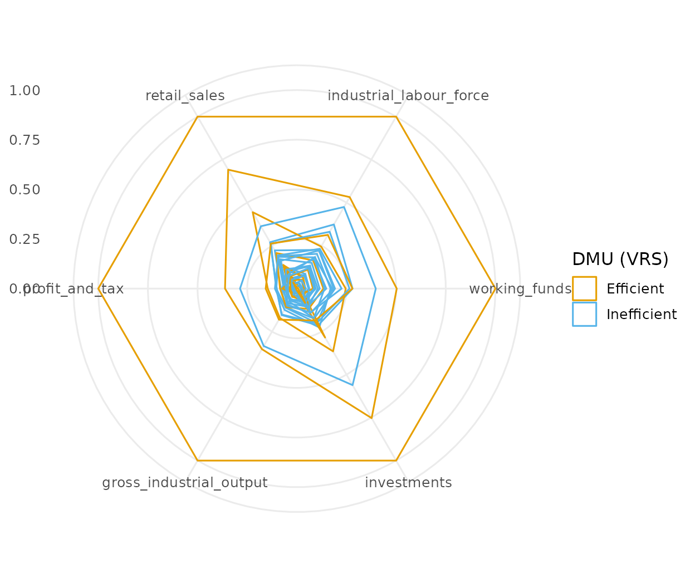

``` r

plot_io_parcoo(d, efficiency = "vrs", x_angle = 30)
```

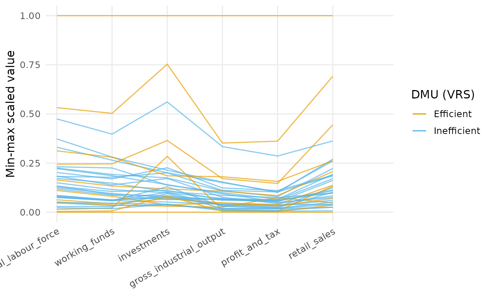

Both accept a `variables` argument to show a subset of the profile:
`"all"` (the default), `"inputs"`, `"outputs"`, or a vector of variable
names or positions.

``` r

plot_io_parcoo(d, variables = "inputs", efficiency = "vrs", x_angle = 30)
```

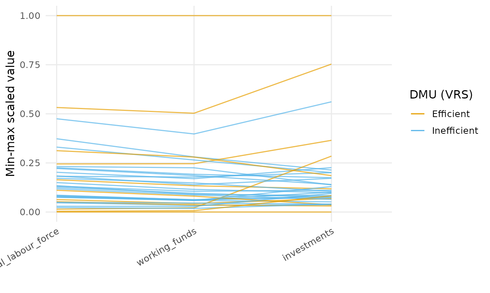

## Highlighting a single DMU: the focus view

This feature is so useful that it demands a dedicated section to explain
it in further details. Pass one DMU name to `labels` and `deaviz` puts
it centre stage: it is ringed and labelled, while everything else fades
back. For the network plots the focus keeps the chosen DMU’s
sub-network; for the panel biplot it keeps that DMU’s trajectory.

``` r

plot_io_pca_biplot(d, rts = "vrs", labels = "Beijing")
```

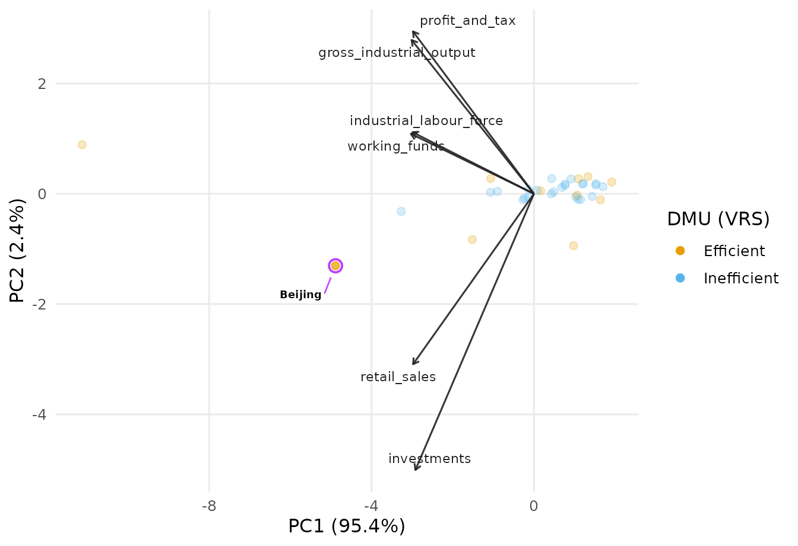

The amount of fade is tunable through the same `fade` argument: `TRUE`
(default) uses a sensible level, `FALSE` turns it off, and a number sets
the alpha of the faded marks directly (larger keeps them more visible).

``` r

plot_io_parcoo(d, efficiency = "vrs", labels = "Beijing", fade = 0.4)
```

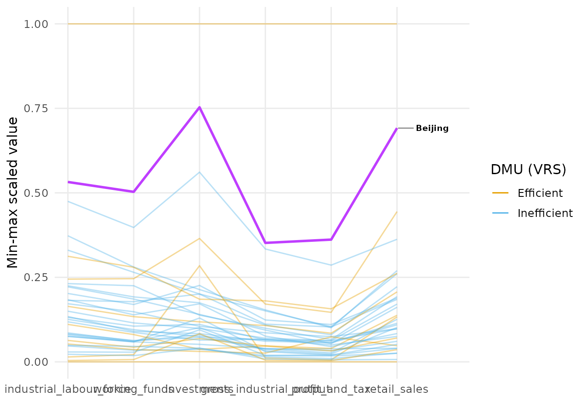

Other `labels` modes are `"all"` (label everyone), `"id"` (number each
marker), and `"max.overlaps"` (label as many as fit without collision).

``` r

plot_cem_unfolding(cem, labels = "id")
```

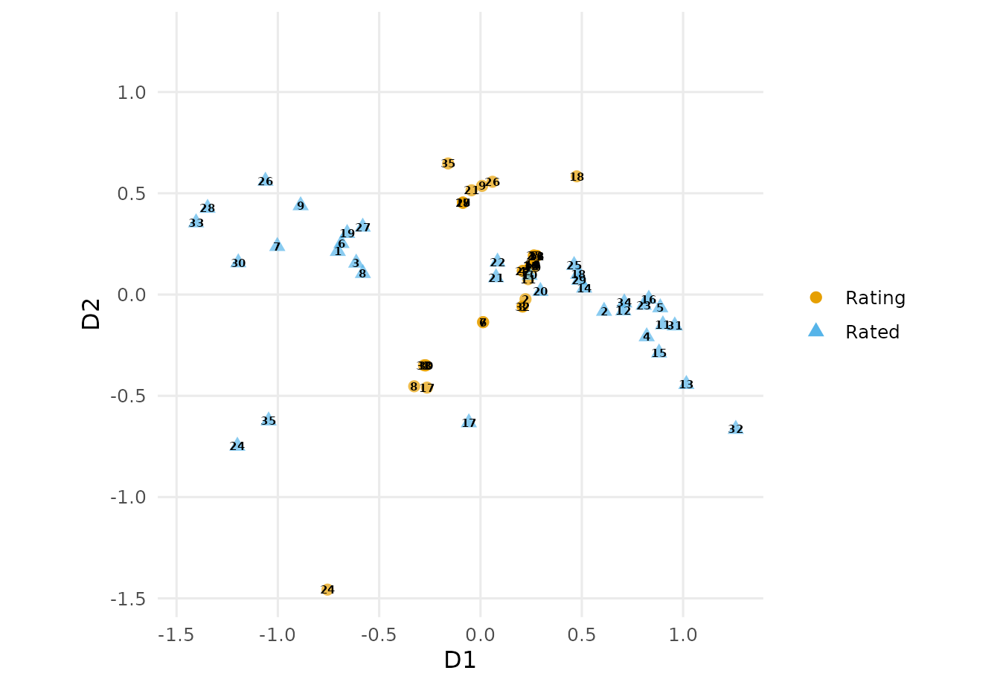

## Self-organising maps

[`compute_som()`](https://pomelo64.github.io/deaviz/reference/compute_som.md)
trains a self-organising map (Kohonen, 2001) on the input/output
profiles, via the **kohonen** package (Wehrens & Kruisselbrink, 2018);
[`plot_io_som()`](https://pomelo64.github.io/deaviz/reference/plot_io_som.md)
colours the map by mean efficiency per node.

``` r

som <- compute_som(d)
plot_io_som(som)
```

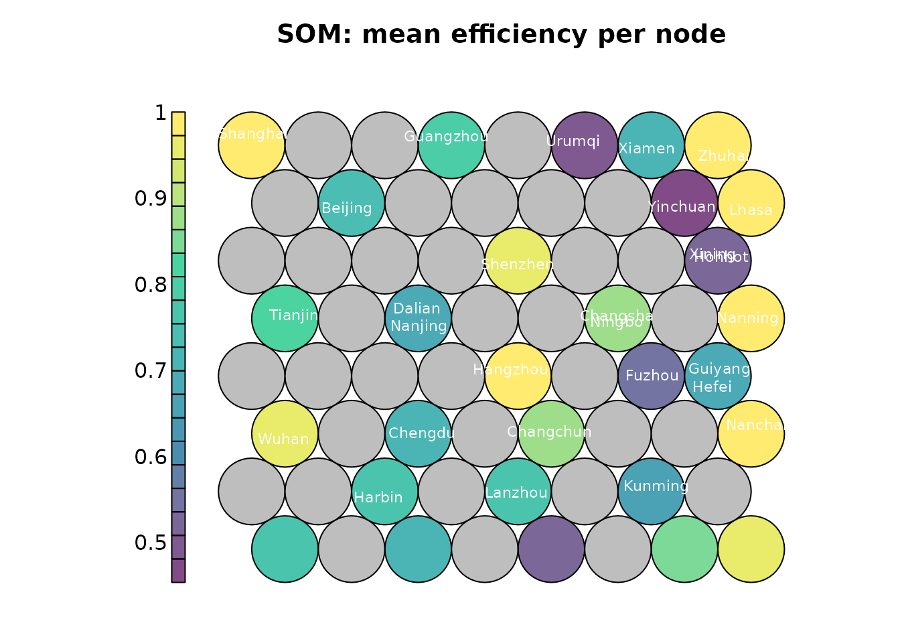

## Multi-period data: trajectories

For panel data,
[`plot_panel_io_biplot()`](https://pomelo64.github.io/deaviz/reference/plot_panel_io_biplot.md)
places every DMU-period on a shared PCA biplot and joins each DMU’s
points into a trajectory over time. The bundled `taiwanese_banks`
dataset is a balanced panel of 22 commercial banks over 2009-2011 (Kao &
Liu, 2014). Inputs and outputs can be given by position.

``` r

plot_panel_io_biplot(
  taiwanese_banks, id = "DMU", period = "Year",
  inputs = 3:5, outputs = 6:8, labels = "Cathay"
)
```

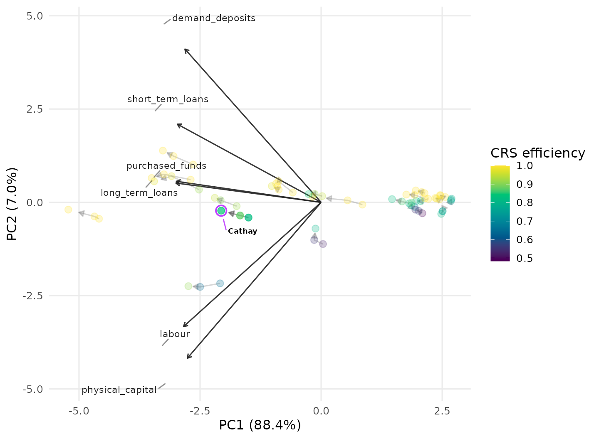

Here the focus view keeps only Cathay’s three-year path lit while the
other banks recede, and the loading vectors are spread apart so their
labels stay legible.

It is noteworthy that the PCA is computed over the pooled data.

[`plot_panel_io_parcoo()`](https://pomelo64.github.io/deaviz/reference/plot_panel_io_parcoo.md)
offers a simpler view of the same panel: the periods form the parallel
axes and each DMU is one line, tracing either a single input/output
variable or the per-period efficiency score (each period’s cross-section
solved as its own DEA problem).

``` r

plot_panel_io_parcoo(
  taiwanese_banks, y = "vrs", id = "DMU", period = "Year",
  inputs = 3:5, outputs = 6:8, labels = "Cathay"
)
```

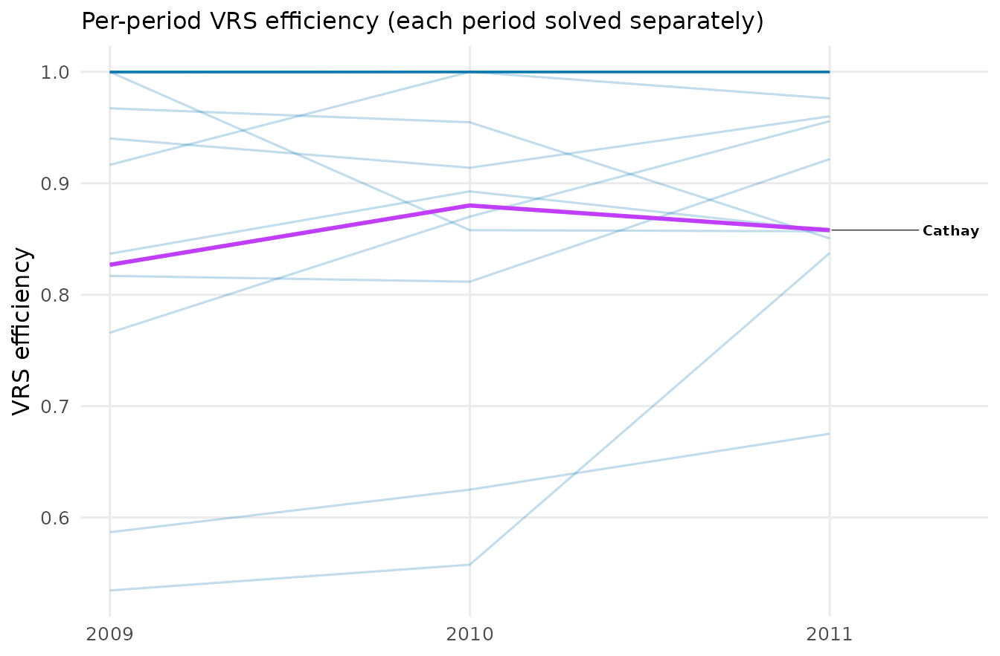

With `color_by_trend = TRUE` each line is coloured by the DMU’s overall
change (last period minus first), so the biggest risers and fallers
stand out.

``` r

plot_panel_io_parcoo(
  taiwanese_banks, y = "demand_deposits", id = "DMU", period = "Year",
  color_by_trend = TRUE
)
```

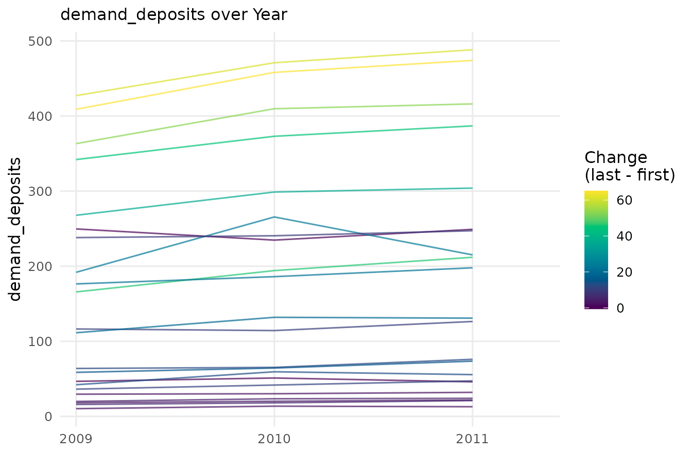

## Interactive plots

Many plots accept `interactive = TRUE`, returning a `plotly` widget with
hover tooltips instead of a static `ggplot`. This needs the `plotly`
package and is best viewed in an HTML context:

``` r

plot_io_pca_biplot(d, rts = "vrs", labels = "Beijing", interactive = TRUE)
```

## References

Adler, N., & Raveh, A. (2008). Presenting DEA graphically. *Omega*,
36(5), 715–729.

Ashkiani, S. (2019). *Four Essays on Data Visualization and Anomaly
Detection of Data Envelopment Analysis Problems* (PhD thesis).
Universitat Autonoma de Barcelona. <https://ddd.uab.cat/record/240333>

Ashkiani, S., & Mar-Molinero, C. (2017). Visualization of
cross-efficiency matrices using multidimensional unfolding. In *Recent
Applications of Data Envelopment Analysis*.

Bana e Costa, C. A., Soares de Mello, J. C. C. B., & Angulo Meza, L.
(2016). A new approach to the bi-dimensional representation of the DEA
efficient frontier with multiple inputs and outputs. *European Journal
of Operational Research*, 255(1), 175–186.
<https://doi.org/10.1016/j.ejor.2016.05.012>

Charnes, A., Cooper, W. W., & Rhodes, E. (1978). Measuring the
efficiency of decision making units. *European Journal of Operational
Research*, 2(6), 429–444. <https://doi.org/10.1016/0377-2217(78)90138-8>

de Leeuw, J., & Mair, P. (2009). Multidimensional scaling using
majorization: SMACOF in R. *Journal of Statistical Software*, 31(3),
1–30. <https://doi.org/10.18637/jss.v031.i03>

Doyle, J., & Green, R. (1994). Efficiency and cross-efficiency in DEA:
Derivations, meanings and uses. *Journal of the Operational Research
Society*, 45(5), 567–578. <https://doi.org/10.1057/jors.1994.84>

Kao, C., & Liu, S.-T. (2014). Multi-period efficiency measurement in
data envelopment analysis: The case of Taiwanese commercial banks.
*Omega*, 47, 90–98. <https://doi.org/10.1016/j.omega.2013.09.001>

Kohonen, T. (2001). *Self-Organizing Maps* (3rd ed.). Springer.

Porembski, M., Breitenstein, K., & Alpar, P. (2005). Visualizing
efficiency and reference relations in data envelopment analysis with an
application to the branches of a German bank. *Journal of Productivity
Analysis*, 23(2), 203–221. <https://doi.org/10.1007/s11123-005-1328-5>

Sammon, J. W. (1969). A nonlinear mapping for data structure analysis.
*IEEE Transactions on Computers*, C-18(5), 401–409.
<https://doi.org/10.1109/T-C.1969.222678>

Sueyoshi, T. (1992). Measuring the industrial performance of Chinese
cities by data envelopment analysis. *Socio-Economic Planning Sciences*,
26(2), 75–88. <https://doi.org/10.1016/0038-0121(92)90015-W>

Wehrens, R., & Kruisselbrink, J. (2018). Flexible self-organizing maps
in kohonen 3.0. *Journal of Statistical Software*, 87(7), 1–18.
<https://doi.org/10.18637/jss.v087.i07>

## Where to next

Every function has its own help page with a full argument list and
examples
(e.g. [`?plot_panel_io_biplot`](https://pomelo64.github.io/deaviz/reference/plot_panel_io_biplot.md)).
To cite the package, see `citation("deaviz")`.
